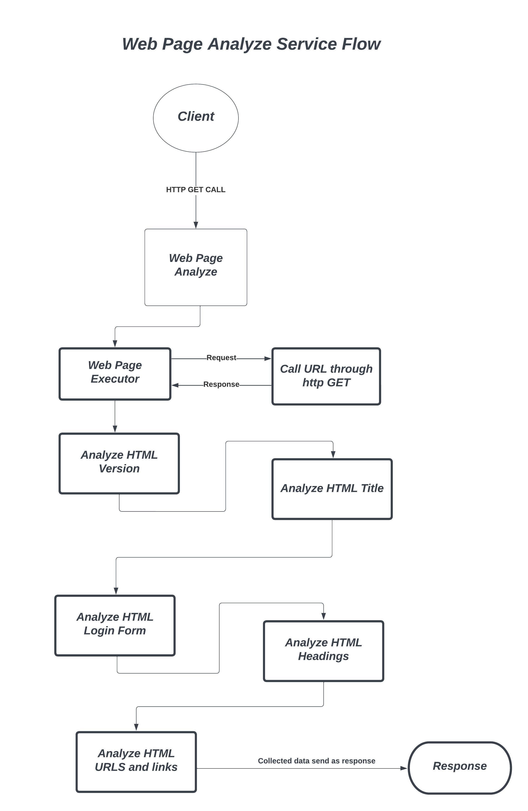

# Web Page Analyze Service

# Introduction
This service process and analyze the web page and given the conent details to the user.

```
The application should show a form with a text field in which users can type in the URL of the web page to be analyzed. Additionally, to the form, it should contain a button to send a request to the server.

After processing the results should be shown to the user.

Results should contain next information:

-   What HTML version has the document?
-   What is the page title?
-   How many headings of what level are in the document?
-   How many internal and external links are in the document? Are there any inaccessible links and how many?
-   Does the page contain a login form?

In case the URL given by the user is not reachable an error message should be presented to a user. The message should contain the HTTP status code and a useful error description.

```

# Design Explanation
Execute the user givn URL and get the response as text content, then passed to the analyze functions to collect date and return to the user. If getting any execption then error response. Please refer flow diagram for better understanding.




# Technology Stack
- Backend - Golang `1.24.3`
- Frontend - Angular `10.2.4`

## Used Libraries
1. [Gin framework](https://github.com/gin-gonic/gin) - For handle HTTP requests and responses.
3. [Testify](https://github.com/stretchr/testify) - For assertions in unit tests.

## Unit tests

```
go test ./... -v -cover -coverpkg=./... -coverprofile=./coverage.out ./... > console.log
go tool cover -html=coverage.out
```
This generates the `coverage.out` file and all testing consoles are writing to console.log.
_go tool_ command use to generate the HTML page for test coverage of each file

## Build the project and Run the application
> [!TIP]
> Root folder has _build.sh_. run that file using *sh build.sh* command and it's generate *web-page-analyzer-service* binary version application in *cmd* folder. Go to that folder and open the terminal and execute the command *./web-page-analyzer-service* then server will run on the *http://localhost:8888/*.

> [!TIP]
> In root folder open the *cmd* and run the command *go mod tidy* to build the application and go to the *cmd* folder and exeute the command *go run main.go* for run the application.

## API Endpoints

This contains endpoints;
- `GET` `/api/v1/analyze?url=<URL>` - Analysis for given URL which should be passed as a query param.

# Special Note
Frontend application runs on angular for that need below dependecy for running on your local
- Node verion `22.12.0`
- NPM version `10.9.0`

[Frontend Web Application Client](https://github.com/safranfaiz/web-page-anapyze-ui.git) - Clone this Application and run as below instruction
- Clone the application and go to the **web-page-anapyze-ui** root folder
- open the cmd and execute the command for build **npm install**
- use **ng serve** command for start the server and it's running the **http://localhost:4200/**
- If you got any error while starting the angular application then set the **set NODE_OPTIONS=--openssl-legacy-provider** command to your terminal and run the **ng serve** 
